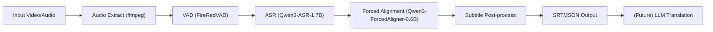

# jamak 프로젝트 기획서 (v0.2)

- 작성일: 2026-02-18
- 프로젝트명: `jamak` (한국어 "자막"의 영문 표기)
- 개발 시작 환경: Apple Silicon Mac
- 목표 실행 환경: CUDA(엔비디아), ROCm(AMD), Intel GPU 기반 서버/NAS

## 1. 프로젝트 개요

`jamak`은 영상/음성 파일에서 정확한 싱크의 자막을 생성하는 도구다.  
핵심 파이프라인은 다음과 같다.

1. `FireRedVAD`로 음성 구간 검출
2. `Qwen3-ASR-1.7B`로 음성 인식
3. `Qwen3-ForcedAligner-0.6B`로 단어/문장 타임스탬프 정렬
4. SRT 자막 파일로 출력 (MVP 기준)

중장기적으로 OpenAI-Compatible API 기반 번역 자막 생성 기능을 추가한다.

## 2. 목표와 범위

### 목표 (MVP)

1. Typer 기반 CLI로 단일 파일 자막 생성
2. 로컬 환경에서 여러 파일 배치 처리
3. `FireRedVAD -> Qwen3-ASR -> Qwen3-ForcedAligner` 파이프라인 안정 동작
4. SRT 출력 및 기본 로그/메타데이터 저장
5. `whisperX`와 유사한 정렬 품질 중심 사용성 확보

### 비목표 (초기 제외)

1. 실시간 스트리밍 ASR
2. 기본 WebUI 제공
3. Docker 배포 및 NAS 운영 자동화
4. 자막 번역 기능(LLM API 연동)
5. 고급 자막 편집기(스타일 편집, 타임라인 UI)
6. 자동 번역 품질 보정(전문 용어 사전, 후편집 도구)

## 3. 핵심 사용자 시나리오

1. 개발자가 로컬 폴더에 영상/음성 파일 여러 개를 준비한다.
2. 개발자가 로컬 폴더의 입력 파일을 CLI로 배치 실행한다.
3. 작업 상태(대기/실행/완료/실패)를 확인한다.
4. 결과물(SRT, 로그, 메타데이터)을 확인한다.
5. (확장 단계) WebUI/NAS/번역 파이프라인으로 확장한다.

## 4. 아키텍처 초안



### 구성 원칙

1. 엔진(`core`)과 인터페이스(`cli`, `web`) 분리
2. GPU 백엔드 의존성 분리(CUDA/ROCm/Intel 백엔드 추상화)
3. 작업 단위를 명시적으로 저장(재시도/복구 가능)
4. 동일 파이프라인을 CLI/WebUI 모두에서 재사용
5. CUDA 우선 구현 후에도 코드 구조를 바꾸지 않도록 백엔드 어댑터 인터페이스를 고정

## 5. 제안 디렉터리 구조

```text
jamak/
  src/jamak/
    core/
      pipeline.py
      vad.py
      asr.py
      align.py
      subtitle.py
      translate.py        # future
    infra/
      ffmpeg.py
      device.py
      model_loader.py
      storage.py
    app/
      typer_cli.py
      web_api.py
      web_ui.py
    schemas/
      job.py
      segment.py
      subtitle.py
  tests/
    unit/
    integration/
  docker/
    Dockerfile.cpu
    Dockerfile.cuda
    Dockerfile.rocm
    Dockerfile.intel
  docs/
    PROJECT_PLAN.md
```

## 6. CLI 설계 (Typer 기준)

### 명령어 초안

1. `jamak transcribe <input>`
2. `jamak batch <input_dir>`
3. `jamak doctor` (환경 점검: ffmpeg/GPU/모델 접근성)
4. `jamak web --host 0.0.0.0 --port 7860` (확장 단계)

### 공통 옵션 예시

1. `--device auto|cpu|cuda` (MVP), `rocm|intel` (확장 단계)
2. `--output-format srt` (MVP 고정)
3. `--language <code>`
4. `--batch-size <n>`
5. `--translate-to <lang>` (future)
6. `--hf-cache <path>`

## 7. WebUI 확장 설계

아래 항목은 **확장 단계(비-MVP)** 로 분류한다.

1. 파일 업로드/경로 입력
2. 작업 큐 생성
3. 작업 상태 표시(진행률/오류 메시지)
4. 결과 다운로드(SRT)
5. 로그 보기(간단 버전)

구현은 `FastAPI + 간단 템플릿 UI`를 기준으로 한다.  
확장 단계에서는 기능 완성도를 우선하고, 디자인 고도화는 후순위로 둔다.

## 8. 실행 환경 및 배포 전략

아래 항목은 **확장 단계(비-MVP)** 로 분류한다.

### 개발 환경 (Mac, Apple Silicon)

1. CPU 또는 MPS로 기본 동작 검증
2. 모델 API 및 파이프라인 정확도 우선 검증

### 서버 환경 (운영)

1. 1차 운영 타깃: CUDA(엔비디아 서버)
2. ROCm/Intel 대응은 Phase 4 완료 이후 검증
3. 초기 설계부터 백엔드 추상화로 호환성 확장 시 코드 재작성 리스크 최소화

### Docker 전략

1. 1차 이미지: `cpu/cuda` 우선
2. 공통 앱 레이어 + 백엔드별 런타임 레이어
3. 볼륨 마운트 기준 고정
4. `HF_HOME`, `TRANSFORMERS_CACHE`를 외부 볼륨으로 분리

### NAS 운용 고려사항

1. 입력/출력 디렉터리 분리
2. 동시 작업 수 제한(메모리 보호)
3. 실패 작업 재시도 정책

## 9. 데이터 모델/산출물

1. `*.srt` (MVP 기본 산출물)
2. `*.segments.json` (디버깅/재처리용)
3. `run.json` (모델 버전, 처리 시간, 디바이스 정보)
4. 에러 로그(`*.log`)

## 10. 품질 지표

1. 인식 정확도: CER/WER
2. 정렬 정확도: 구간 단위 타임오차(ms)
3. 처리 성능: 실시간 배수(RTF), 파일당 처리 시간
4. 안정성: 실패율, 재시도 성공률

## 11. 테스트 전략

1. 단위 테스트: 파이프라인 컴포넌트 I/O 계약 검증
2. 통합 테스트: 샘플 음성으로 end-to-end 검증
3. 회귀 테스트: 모델/전처리 변경 시 결과 비교
4. 운영 테스트: 장시간/대용량 배치 시 메모리/속도 검증

## 12. 단계별 로드맵

### Phase 0: 기반 정리

1. 프로젝트 뼈대(`src/`, `tests/`, `docs/`) 구성
2. Typer CLI 엔트리포인트 구성
3. `jamak doctor` 구현

### Phase 1: MVP 자막 생성

1. `ffmpeg` 오디오 추출
2. `FireRedVAD` + `Qwen3-ASR` + `Qwen3-ForcedAligner` 연결
3. 로컬 CLI(`transcribe`, `batch`, `doctor`) 완성
4. SRT + JSON 로그 출력
5. 샘플 데이터 기준 품질/성능 기준선 측정

### Phase 2: WebUI 확장

1. 간단 WebUI 제공
2. 로컬 CLI 파이프라인과 WebUI 통합
3. 작업 상태/로그 조회 기능 제공

### Phase 3: Docker/NAS 확장

1. Docker 이미지 제공(CPU + CUDA 우선)
2. CUDA 기반 NAS 배포 가이드 작성
3. 운영 로그/재시도 정책 정리

### Phase 4: 번역 확장 (Future)

1. OpenAI-Compatible API 기반 자막 번역
2. 비용/품질 트레이드오프 정책
3. 언어별 프롬프트 템플릿

### Phase 5: 멀티 백엔드 확장 (Post-Phase4)

1. ROCm 런타임 검증 및 패키징
2. Intel GPU 런타임 검증 및 패키징
3. 백엔드별 회귀 테스트 자동화

## 13. 리스크와 대응

1. Python 최신 버전 호환성
   - 리스크: 최신 Python 버전의 AI/오디오 스택 지원이 지연될 수 있음
   - 대응: `3.14 -> 3.13 -> 3.12` 순으로 단계 하향하는 버전 정책 적용
2. 모델 조합 호환성
   - 리스크: VAD 분절과 forced alignment 입력 형식 불일치 가능
   - 대응: 표준 `Segment` 스키마 정의 후 어댑터 계층으로 변환
3. 장시간 영상 성능/메모리
   - 리스크: OOM 및 처리 지연
   - 대응: 청크 처리, 배치 크기 자동 조절, 작업 동시성 제한
4. 운영 환경 다양성
   - 리스크: CUDA/ROCm/Intel별 런타임 차이
   - 대응: 초기부터 공통 백엔드 인터페이스 고정 + 백엔드별 Dockerfile/회귀 테스트 분리
5. 라이선스/배포 정책
   - 리스크: 모델/의존성 라이선스 조건 미확인 시 배포 제약
   - 대응: 릴리즈 전 라이선스 점검 체크리스트 필수화

## 14. 기술 결정사항 (확정)

1. Python 버전 정책: 최신 권장 버전 우선(`3.14`) 후 미지원 시 `3.13`, `3.12` 순으로 하향
2. WebUI 스택: `FastAPI 템플릿` 고정 (Gradio 미사용)
3. 운영 우선순위: `CUDA` 우선, ROCm/Intel 검증은 Phase 4 이후
4. 결과 기본 포맷: `SRT` 단일 출력 (MVP)
5. 번역 API 인터페이스: OpenAI-Compatible 표준 채택

## 15. 첫 스프린트 체크리스트 (실행용)

1. `jamak doctor`로 ffmpeg/GPU/캐시 경로 점검
2. 샘플 2개(짧은 파일/긴 파일)로 파이프라인 검증
3. SRT 출력과 정렬 오차 수동 검수
4. 실패 케이스 로그 형식 확정
5. 로컬 CLI 기준 재현 가능한 실행 절차 문서화
